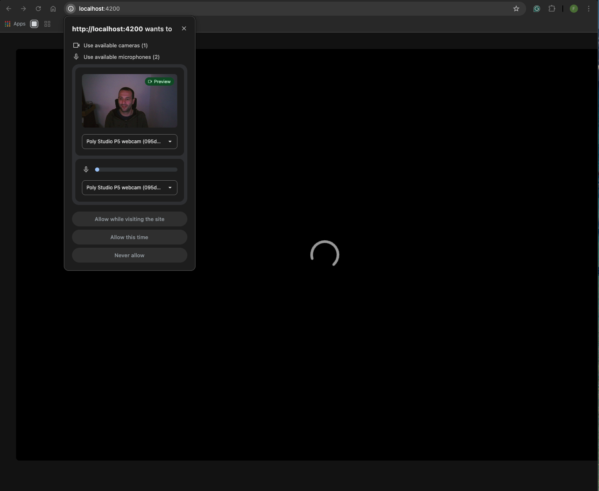
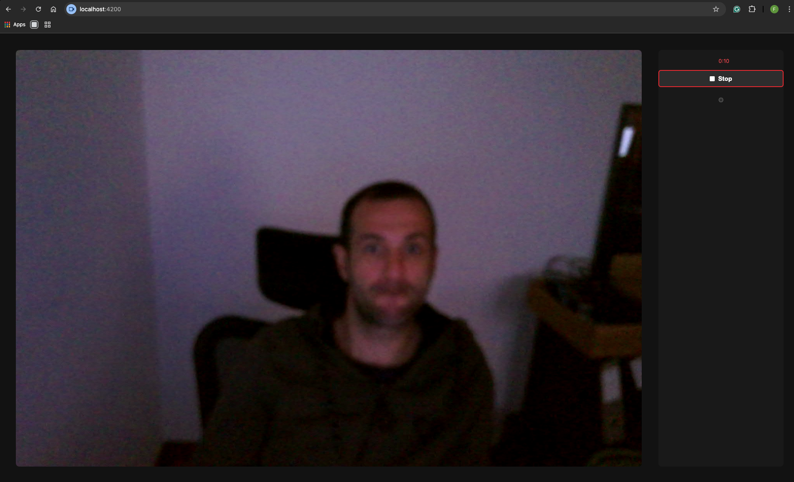
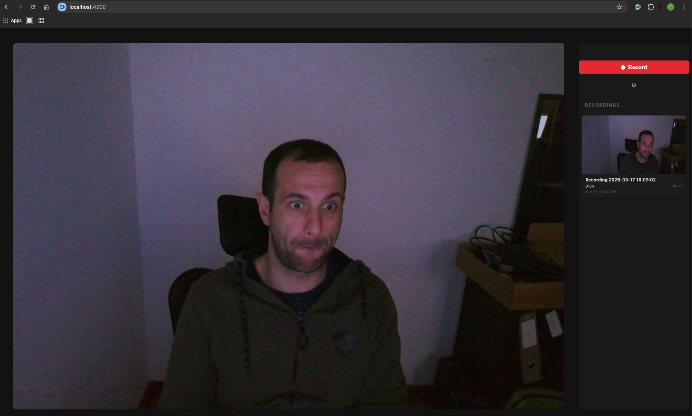
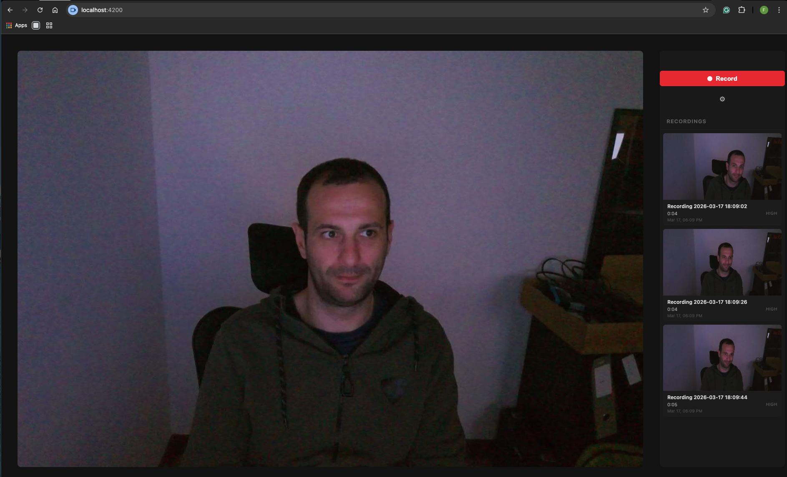
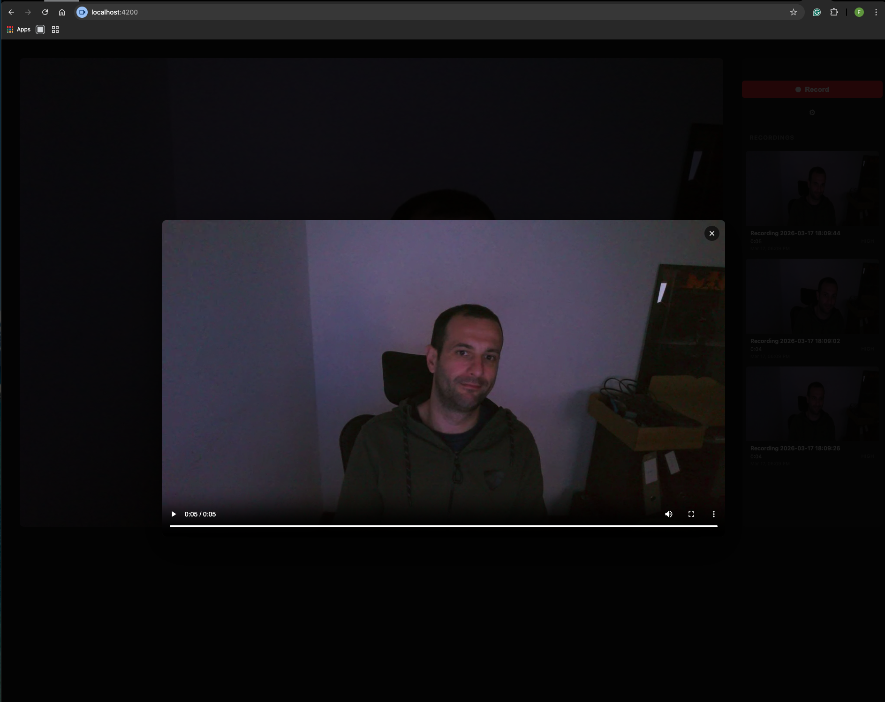
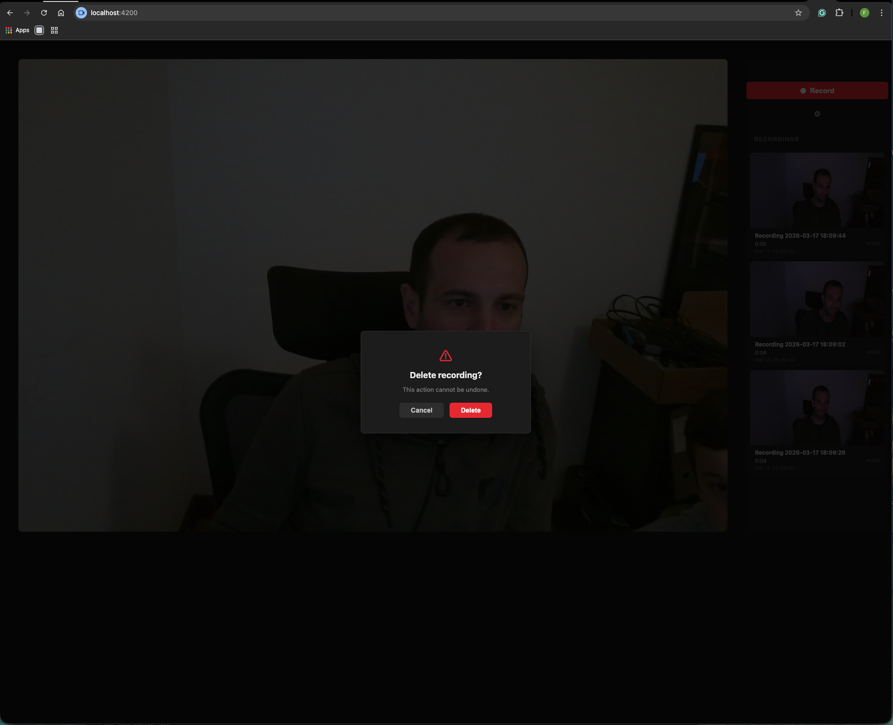
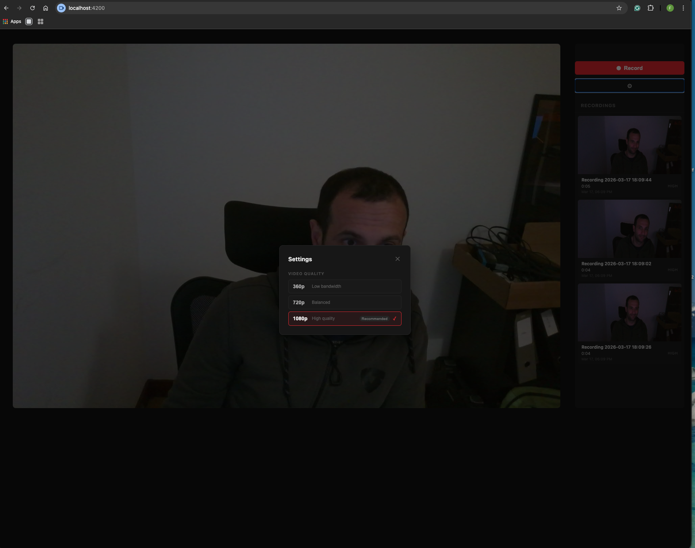

# SpeakNow — Webcam Video Recorder

A webcam recorder built with Angular 21, NGXS state management, and IndexedDB persistence.

## Setup

```bash
npm install
ng serve        # dev server at http://localhost:4200
npm test        # run all tests (Vitest)
ng build        # production build
```

Grant camera/microphone permission when prompted.

## Features

- **Record** webcam video at low / medium / high quality
- **Automatic quality selection** — bandwidth is tested on startup and the best quality is pre-selected
- **Thumbnail capture** — a frame is captured from every recording and shown in the sidebar
- **Persistent storage** — recordings survive page reloads via IndexedDB (video blobs + metadata stored separately)
- **Playback** — click any thumbnail to watch the recording in a modal
- **Delete** — remove recordings with a confirmation step; failed deletes are rolled back automatically
- **Settings panel** — change quality at any time; the camera stream restarts automatically

## Architecture

### State (NGXS)

Three state slices, each with a clear responsibility:

| State | Responsibility |
|---|---|
| `BandwidthState` | Detected/selected quality (`low \| medium \| high`) |
| `RecordingState` | Camera lifecycle (`idle → initializing → recording → stopping → error`) |
| `VideosState` | Recorded video metadata list + error signals |

`APP_INITIALIZER` runs `DetectBandwidth → InitializeCamera + LoadVideos` as a sequential Observable chain before the first render.

### Persistence

`VideoStorageService` wraps the `idb` library with two object stores:

- **`videos-meta`** — lightweight `VideoMeta` records (id, name, date, duration, quality, thumbnail data URL)
- **`videos-blob`** — raw `Blob` objects keyed by the same id

`SaveVideo` writes to IDB first, then updates state on success. `DeleteVideo` is optimistic (removes from state immediately) and rolls back on IDB failure.

### Reactive patterns

All async work uses RxJS Observables — no `async/await`, `Promise`, `try/catch`, `setTimeout`, or `setInterval` in application code. The `idb` library is Promise-based; `from()` bridges it at the service boundary. Timing (elapsed recording timer, bandwidth timeout) uses `interval()` and `race()` with `timer()`.

### Bandwidth detection

On startup, the app fetches a 100 KB asset (`/assets/bandwidth-test.bin`) and races it against a 5-second `timer()`. The result maps to a quality tier:

| Mbps | Quality |
|---|---|
| ≥ 5 | high (1080p) |
| 1–5 | medium (720p) |
| < 1 | low (360p) |
| timeout | medium |
| error | low |

## Screenshots

### Camera preview (idle state)


### Active recording


### Thumbnail after first recording


### Sidebar with multiple recordings


### Video playback modal


### Delete confirmation dialog


### Settings panel


## Assumptions & trade-offs

- **No server** — everything is client-side; IndexedDB is the only storage
- **No routing** — single-page app, no URL-based navigation needed
- **Zoneless Angular** — uses `provideZonelessChangeDetection()` with OnPush throughout; signals drive all reactivity
- **Blob lifecycle** — `URL.createObjectURL` URLs are revoked immediately after the playback modal closes to prevent memory leaks
- **MediaRecorder format** — prefers `video/webm;codecs=vp9`, falls back through vp8/webm/mp4 depending on browser support
- **Thumbnail** — captured at 0.5 s (or mid-point for very short clips) at 260×180 px; stored inline as a PNG data URL in the metadata record to avoid a separate IDB lookup on every render
